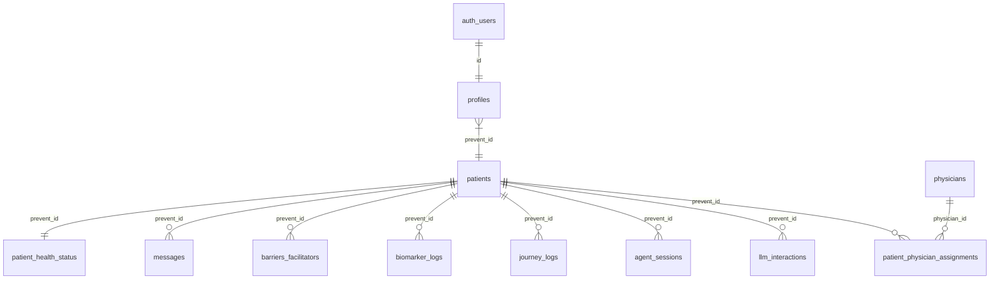

# Strategic Development Plan: Supabase Migration and Integration

This document outlines the roadmap and proposed architecture for integrating **Supabase** into the backend and frontend of **PREVENT Dawn**, ensuring robust persistence, patient privacy compliance (pseudonymization), and tight synchronization with the authentication module (Login).

---

## 1. Context and Goals

Currently, **PREVENT Dawn** stores multi-agent conversational state in a local SQLite database (`aiosqlite`) and loads static patient test data from an Excel spreadsheet.

To transition the platform to a production-ready state and enable clinical studies with multiple simultaneous users, we will migrate all persistence to **Supabase** (PostgreSQL cloud).

### Key Goals
*   **Centralized Persistence**: Replace the local SQLite file with a cloud-based relational Supabase database.
*   **Privacy by Design**: Implement a dissociated/pseudonymized data model in Supabase, keeping authentication credentials strictly separated from clinical metrics and conversational logs.
*   **Authentication Synchronization**: Coordinate with the Login module to secure data access using JWT tokens and RLS (Row Level Security).
*   **Clinical Tracking & Insights**: Dynamically record barriers, facilitators, biomarkers, and stages of change identified by the AI agents during motivational dialogue.

---

## 2. Supabase Data Schema Map

The schema file provided in `backend/data/db.txt` defines a highly structured and optimized relational database model:



### Critical Tables Overview

1.  **`patients`**: Stores the unique research identifier (`prevent_id` uuid). Contains no direct Personally Identifiable Information (PII). Holds an alias (`nickname`) and activity timestamps.
2.  **`profiles`**: Bridge table. The `id` field is a UUID referencing the authenticated Supabase user (`auth.users(id)`). Its `prevent_id` serves as the secure link to the clinical app data.
3.  **`patient_health_status`**: Tracks the patient's current stage of change (Transtheoretical Model) and clinical diabetes risk level.
4.  **`agent_sessions`**: Persists the orchestrator's state machine context (`current_agent` and context variables in a `context_variables` JSONB column).
5.  **`messages`**: Chronological log of chat messages sent by the user or assistant, supporting vector embeddings in the `embedding` column for semantic context.
6.  **`barriers_facilitators`**: Granular storage of motivators and obstacles detected by the AI agent system.
7.  **`biomarker_logs`**: Logs clinical evolution metrics (`a1c`, `fbs`, `bmi`).

---

## 3. Development Roadmap (5 Phases)

### Phase 1: Backend Infrastructure & Supabase Client
*   **Goal**: Establish a robust asynchronous connection to Supabase and abstract data access.
*   **Actions**:
    1.  Add dependencies in `backend/requirements.txt`:
        ```text
        supabase>=2.3.0
        postgrest>=0.16.0
        ```
    2.  Configure credentials in `backend/.env`:
        ```env
        SUPABASE_URL=https://your-project.supabase.co
        SUPABASE_KEY=your-anon-public-key
        SUPABASE_SERVICE_ROLE_KEY=your-service-role-key (for backend administrative operations)
        ```
    3.  Create the client module `backend/services/supabase_client.py`:
        ```python
        import os
        from supabase.client import create_client, Client
        
        supabase_url = os.getenv("SUPABASE_URL")
        supabase_key = os.getenv("SUPABASE_SERVICE_ROLE_KEY") # Secure service operations key
        
        supabase: Client = create_client(supabase_url, supabase_key)
        ```
    4.  Refactor `backend/services/persistence.py` to create a clean database interface implementing Supabase queries.

### Phase 2: Authentication Synchronization (Login Coordination)
*   **Goal**: Ensure each chat session is securely tied to a verified user authenticated via a JWT token.
*   **Actions**:
    1.  **Security Middleware**: Design a FastAPI dependency (`backend/api/auth.py`) that extracts the Bearer JWT token sent by the frontend.
    2.  **Validation**: Use `supabase.auth.get_user(jwt_token)` to verify token validity and retrieve the unique authentication ID (`supabase_user_id`).
    3.  **Profile Initialization**:
        *   Query the `profiles` table using the `supabase_user_id`.
        *   If the profile does not exist (first login), insert a row linking `supabase_user_id` to a newly generated `patient` (creating their `prevent_id`).
        *   Initialize a default record in `patient_health_status`.

### Phase 3: Conversational Logging and Orchestrator Sessions
*   **Goal**: Replace local SQLite orchestrator state with real-time Supabase table writes.
*   **Actions**:
    1.  **Session State**: Update `get_or_create_state` and `save_state` inside the `Orchestrator` to read and write directly to `agent_sessions`.
    2.  **Message History**: Write messages asynchronously to the `messages` table instead of storing a single JSON string. This enables efficient paginated history loads:
        ```python
        # Conceptual insert example
        supabase.table("messages").insert({
            "prevent_id": prevent_id,
            "role": "user",
            "content": user_input
        }).execute()
        ```
    3.  **LLM Interaction Logs**: Route logs from the MCP Server's `llm_interactions` to Supabase for auditing clinical safety and tracking Gemini API costs.

### Phase 4: Clinical Agents & Insight Extraction
*   **Goal**: Dynamically update the patient's behavioral profile in the database based on chatbot interactions.
*   **Actions**:
    1.  **Barriers & Facilitators Detector**: Use extraction signatures (e.g. DSPy) to categorize and store barriers/facilitators in the `barriers_facilitators` table when detected by an agent.
    2.  **Stage of Change Transitions**: When the state machine (`state_machine.py`) detects a progression in the patient's motivational state, update `patient_health_status` and log the event in `journey_logs`.
    3.  **Biomarker Ingestion**: Log clinical metrics (`a1c`, `fbs`, `bmi`) provided voluntarily by the user during the chat into `biomarker_logs`.

### Phase 5: Prismatic Dashboard Integration (Frontend)
*   **Goal**: Feed real-time Supabase data into premium, glassmorphic UI components.
*   **Actions**:
    1.  **Read APIs**: Develop fast FastAPI endpoints to fetch medical progression:
        *   `/api/dashboard/insights` -> Returns strengths/challenges from `barriers_facilitators`.
        *   `/api/dashboard/biomarkers` -> Returns time-series data for interactive charts.
        *   `/api/dashboard/health-status` -> Returns the current stage of change and diabetes risk levels.
    2.  **Frontend Consumption**: Use the React HTTP client to call these endpoints and populate Dashboard components.
    3.  **Real-Time Subscriptions (Optional)**: Enable Supabase Realtime in the frontend to trigger UI updates automatically when new messages or clinical logs are inserted.

---

## 4. Design and Integration Decisions

After reviewing the architectural questions, the following design decisions have been finalized:

1. **User Registration Triggers**: 
   * **Decision**: We will implement a PostgreSQL function and trigger in Supabase. When a new user registers in `auth.users`, the database will automatically insert the corresponding rows into `profiles` and `patients`. This prevents synchronization issues.
2. **Vector Embeddings (Semantic Memory)**:
   * **Decision**: Yes, we will enable the `pgvector` extension in Supabase immediately. We will use the Google Gemini Embeddings API (`text-embedding-004`) from the backend to vectorize and search chat messages. This feature is extremely cheap/free under standard developer tiers.
3. **Database Access**:
   * **Decision**: All database operations will be routed through the FastAPI Backend using `supabase-py` and the backend `service_role_key`. This guarantees business logic, state machine changes, and security are handled strictly in Python, avoiding direct database queries from the Frontend.
